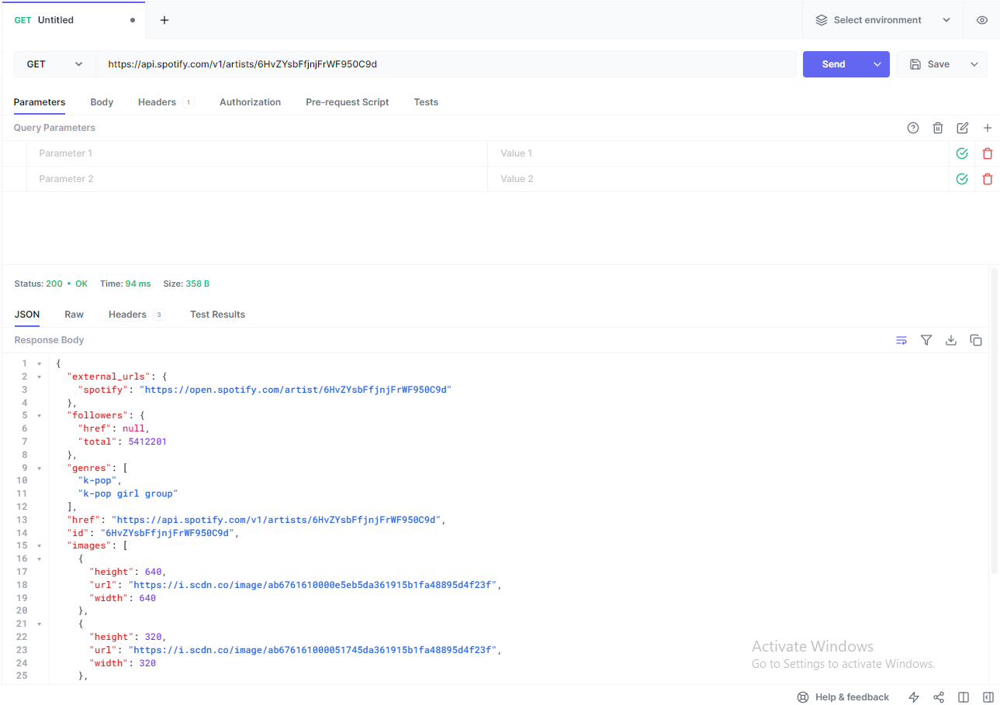
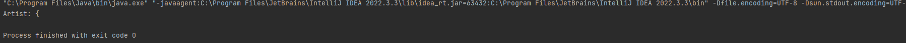

CSC207-Group-Project
group members:
Ian
Anson
Robert
Ricky
Flora

problem domain: 
Trivia. This idea that we have is to make a song guessing game for popular spotify games. The end goal is to create
a platform similar to AMQ (https://animemusicquiz.com/) but for western songs instead of for anime openings/endings. 
Essentially, we are hoping to use the spotify api to collect the user's playlist/most frequently played songs and 
then generate short audio snippets (10-15 seconds) after which they have to guess the name of the song (this part is not done
by the spotify api). There would 10-30 rounds of this, where each correctly guessed song gives 1 point. 
This can be a single player game, but we are hoping to make it a multiplayer game 
(although i'm not sure about how to do this yet) on a website interface. 

This link to the spotify api is  https://developer.spotify.com/documentation/web-api

Here is an image of us trying out the spotify api: 

Here is an image of getting a result from an API call in JAVA:

Although though it should look like the result in hopscotch, we still haven't figure out a way to read a JSON object..
That can be counted as technical difficulty. 
